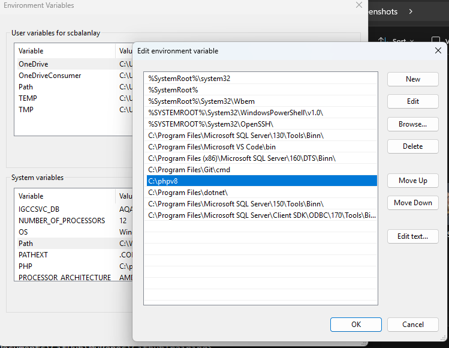

# Running PHP Locally on Windows

This manual provides a step-by-step guide on how to run **PHP locally on Windows** using the PHP **binary**. This setup is intended for **local execution only** (for example, running a localhost website) and does **not** require compiling PHP from source.

---

## Prerequisites

* A **Windows** operating system
* Administrator access (required to modify system environment variables)
* An active internet connection

### Download PHP

1. Download the **latest PHP binary for Windows** from the official PHP website.
2. *(Optional)* You may also download the **PHP source code** if you intend to study or compile PHP manually. This is **not required** for local execution.
3. Extract the downloaded PHP binary to the following recommended directory:

```
C:\phpv8
```

> 📌 Using a standard folder path such as `C:\phpv8` helps ensure consistency with examples, figures, and screenshots in this manual.

---

## Add PHP to Environment Variables

1. Open the **Start Menu**.

2. Search for **Environment Variables**.

3. Click **Edit the system environment variables**.

   * This will open the **System Properties** window.

4. In the **System Properties** window, click **Environment Variables…** (located at the bottom-right).

   * A new window will appear.

5. Under the **System Variables** section:

   * Locate and select **Path**
   * Click **Edit…**

6. In the **Edit Environment Variable** window:

   * Click **New**
   * Add the path to your PHP directory:

```
C:\phpv8
```



*Figure 1: Adding `C:\phpv8` to the system Path variable*


> 📌 At this point, your **Path** entry should resemble the example shown in the figure above.

7. Click **OK** to close the **Path** window.
8. Click **OK** again to close the **Environment Variables** window.
9. Click **Apply**, then **OK** on the **System Properties** window.

---

## Verify PHP Installation

1. Open **PowerShell** or **Command Prompt**.
2. Type the following command and press **Enter**:

```
php -v
```

3. If PHP was added correctly to your environment variables, the command will display the **current PHP version** installed on your device.

> ✅ Seeing the PHP version confirms that PHP is now accessible system-wide.

---

## Setup Complete

You have successfully configured **PHP for local execution on Windows** 🎉
You may now proceed with running PHP scripts or setting explaining how to use PHP with a local web server (such as Apache or the built-in PHP server).

---

> ℹ️ **Note:** If `php -v` is not recognized, restart your terminal (or your computer) and recheck the **Path** entry for accuracy.

As a next step, you may start PHP’s built-in development server by running:

```
php -S localhost:8000
```

Do this in your development directory. This allows you to quickly test PHP files in your browser without installing a separate web server.